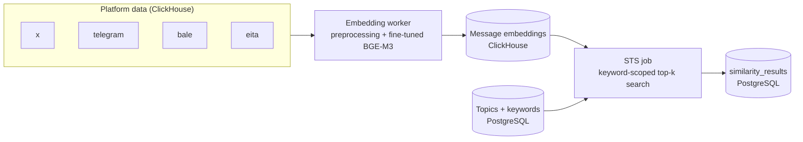

# STS — Semantic Text Similarity for Persian Social Media

Find semantically similar messages across social networks with a **Persian fine-tuned [BGE-M3](https://huggingface.co/BAAI/bge-m3) embedding model**, ClickHouse vector storage, and topic-scoped nearest-neighbour search.


---

## Table of Contents

- [Overview](#overview)
- [How It Works](#how-it-works)
- [Repository Structure](#repository-structure)
- [Prerequisites](#prerequisites)
- [Installation](#installation)
- [Configuration](#configuration)
- [Usage](#usage)
  - [1. Embedding worker](#1-embedding-worker)
  - [2. STS job](#2-sts-job)
- [Data Model](#data-model)
- [Operational Notes](#operational-notes)
- [Troubleshooting](#troubleshooting)
- [Security](#security)

---

## Overview

Social media content in Persian is noisy: informal writing, mixed Arabic/Persian characters, emojis, hashtags, mentions and links. Keyword matching alone cannot tell that two differently worded messages say the same thing.

This project solves that with dense semantic embeddings:

1. **A BGE-M3 model fine-tuned on Persian text** turns every message into a 1024-dimensional vector.
2. Messages from different platforms (**X, Telegram, Bale, Eita**) are embedded by the *same* model, so they live in the *same* vector space and can be compared directly — for example, matching a Telegram message against Eita posts.
3. A **similarity-search job** takes messages that match a topic's keywords, finds their nearest neighbours by vector similarity, and stores the scored pairs in PostgreSQL for downstream analysis.

The repository contains the two production components of that pipeline: the **embedding worker** and the **STS (similarity search) job**.

## How It Works



| Stage | Component | What it does |
|---|---|---|
| 1 | `embedding/` | Cleans Persian text, encodes it with the fine-tuned BGE-M3 model, and writes vectors back to ClickHouse. |
| 2 | `STS job/` | For each topic, selects new messages that match the topic keywords, retrieves the top-k most similar messages by dot product, and saves the pairs with their scores to PostgreSQL. |

## Repository Structure

```
sts/
├── embedding/                  # Stage 1 — text preprocessing & embedding worker
│   ├── embedding_version_2.py  # Worker entry point (all platforms)
│   ├── utils.py                # SimilarityModel: model loading / encoding wrapper
│   ├── preprocessing.py        # Configurable Persian text cleaning
│   ├── config.yaml             # Path to the fine-tuned model
│   └── env                     # Environment variables (ClickHouse connection)
└── STS job/                    # Stage 2 — similarity search job
    ├── sts_job_fin.py          # Continuous similarity-search job
    ├── run_sts.sh              # Launcher (activates .venv, forwards CLI args)
    └── env                     # Environment variables (ClickHouse + PostgreSQL)
```

### `embedding/`

| File | Description |
|---|---|
| `embedding_version_2.py` | The **re-embedding worker**. Loops over the platforms `x → eita → bale → telegram`, finds rows in `raya_sepehr_preprocessed.embeddings` that have no `embedding_2` yet, fetches the original text from each platform's reference table, preprocesses and encodes it in GPU batches, and writes the vector plus the version tag `bge3_finetuned` back to ClickHouse. Rows with missing or empty text receive a zero vector so they are not retried forever. Handles `SIGINT`/`SIGTERM` gracefully (finishes the current batch, then exits). |
| `utils.py` | Defines `SimilarityModel`, a thin wrapper around `SentenceTransformer`. It reads the model path from `config.yaml` (falling back to `BAAI/bge-m3`), selects CUDA when available, supports **hot-reloading** the model via `reload_model()`, and exposes `encode_texts()` (preprocessing + encoding with a maximum sequence length of 8192 tokens). A ready-to-use singleton, `similarity_model`, is created on import. |
| `preprocessing.py` | `dynamic_preprocess()` and `PreprocessingOptions` — a configurable text-cleaning pipeline: URL / mention replacement, hashtag handling (`clean`, `remove`, `keep`), emoji handling (`demojize`, `remove`, `keep`), removal of special characters (Persian/Arabic script, Latin letters, digits and basic punctuation are kept), optional custom regex, Persian ↔ English digit conversion, Arabic-to-Persian character normalization via [Parsivar](https://github.com/ICTRC/Parsivar), and whitespace normalization. Returns `[None]` when nothing is left after cleaning. |
| `config.yaml` | Model configuration. `inference.model_path` points to the fine-tuned model (default: `../models/bge_finetuned`). It can also be a Hugging Face model ID. |
| `env` | Template of the environment variables used by the worker (ClickHouse host, port, user, password). Copy it to `.env` — see [Configuration](#configuration). |

### `STS job/`

| File | Description |
|---|---|
| `sts_job_fin.py` | The **similarity-search job**, running as a continuous loop. Loads topics and keywords from PostgreSQL, picks up new, not-yet-processed messages that match each topic's keywords, finds their top-k nearest neighbours in ClickHouse, stores the results in PostgreSQL and marks the source messages as processed. Fully configurable through CLI arguments. |
| `run_sts.sh` | Convenience launcher. Changes into the project directory, activates `.venv`, and runs `sts_job_fin.py`, forwarding all command-line arguments. |
| `env` | Template of the environment variables used by the job (ClickHouse and PostgreSQL connections). Copy it to `.env`. |

## Prerequisites

- Python **3.9+**
- Access to a **ClickHouse** server (HTTP interface, default port `8123`) holding the platform data
- Access to a **PostgreSQL** database (for the STS job)
- The **fine-tuned BGE-M3 model** available locally (see [Configuration](#configuration))
- *Recommended:* an NVIDIA GPU with CUDA for the embedding worker (it automatically falls back to CPU)

## Installation

```bash
git clone https://github.com/mostafamhm/sts.git
cd sts
```

**Embedding worker**

```bash
cd embedding
python3 -m venv .venv
source .venv/bin/activate
pip install torch sentence-transformers numpy pandas pyyaml pydantic emoji parsivar \
            clickhouse-connect python-dotenv
```

**STS job** (the launcher expects the virtual environment at `STS job/.venv`)

```bash
cd "STS job"
python3 -m venv .venv
source .venv/bin/activate
pip install pg8000 clickhouse-connect python-dotenv
chmod +x run_sts.sh
```

## Configuration

### Fine-tuned model

Place the fine-tuned model at `models/bge_finetuned/` in the repository root, or edit `embedding/config.yaml`:

```yaml
inference:
  model_path: "../models/bge_finetuned"   # local directory or Hugging Face model ID
```

The path is resolved relative to the directory you run the worker from, so start it from inside `embedding/`. If `config.yaml` is missing or `model_path` is empty, the worker falls back to the base `BAAI/bge-m3` model.

### Environment variables

Both programs read a `.env` file located next to the script (via `python-dotenv`). Create it from the provided `env` template and fill in your own values:

```bash
cp env .env      # then edit .env
```

**`embedding/.env`**

```dotenv
CLICKHOUSE_HOST=<host>
CLICKHOUSE_PORT=8123
CLICKHOUSE_USER=<user>
CLICKHOUSE_PASS=<password>

# Optional tuning
SOURCE_DB=raya_sepehr_preprocessed
MAX_FETCH_SIZE=500
GPU_BATCH_SIZE=128
IDLE_WAIT_TIME=20
ERROR_BACKOFF_TIME=10
```

| Variable | Default | Description |
|---|---|---|
| `CLICKHOUSE_HOST` / `PORT` / `USER` / `PASS` | — | ClickHouse connection (HTTP port). |
| `SOURCE_DB` | `raya_sepehr_preprocessed` | Database that contains the `embeddings` table. |
| `MAX_FETCH_SIZE` | `500` | Pending rows fetched per cycle, per platform. |
| `GPU_BATCH_SIZE` | `128` | Number of texts encoded per model batch. |
| `IDLE_WAIT_TIME` | `20` | Seconds to sleep when no platform has pending rows. |
| `ERROR_BACKOFF_TIME` | `10` | Seconds to wait after a database error before reconnecting. |

**`STS job/.env`**

```dotenv
CH_HOST=<host>
CH_PORT=8123
CH_USER=<user>
CH_PASS=<password>

PG_HOST=<host>
PG_PORT=5432
PG_USER=<user>
PG_PASS=<password>
PG_DB=olap
```

## Usage

### 1. Embedding worker

Run it from inside the `embedding/` directory so that `config.yaml`, the relative model path and `.env` are all found:

```bash
cd embedding
source .venv/bin/activate
python embedding_version_2.py
```

The worker runs continuously and can be stopped at any time with `Ctrl+C` (or `SIGTERM`); it finishes the current batch first. It is **resumable**: only rows whose `embedding_2` and `embedding_2_version` are still empty are processed, so a restart simply continues where it stopped.

**Row keys and reference tables**

Each row in the `embeddings` table is identified by a `row_key` whose parts are joined with `||`. The worker uses it to look up the original message text (`txtContent`):

| Platform | `row_key` format | Reference table |
|---|---|---|
| `x` | `user_id\|\|tweet_id` | `x.tweets_2` |
| `eita` | `channel\|\|msgid` | `eita.posts` |
| `bale` | `channel_id\|\|msgid` | `bale.posts` |
| `telegram` | `channel\|\|msgid\|\|comment_id` | `telegram.comments` (joined with `telegram.posts`) |

**Processing steps**

1. Fetch up to `MAX_FETCH_SIZE` pending rows for the current platform.
2. Parse the `row_key` and fetch the message text from the platform's reference table.
3. Clean the text (URLs and mentions removed, hashtags cleaned, emojis removed, special characters stripped, whitespace normalized). `encode_texts()` then applies the default `PreprocessingOptions` before tokenization.
4. Encode with the fine-tuned model in batches of `GPU_BATCH_SIZE`.
5. Write `embedding_2` and `embedding_2_version = 'bge3_finetuned'` back to ClickHouse.

Messages with missing text, `NA`/`NaN` values, or fewer than two characters after cleaning are stored as zero vectors.

### 2. STS job

```bash
cd "STS job"
./run_sts.sh [options]
```

`run_sts.sh` activates `.venv` and forwards every option to `sts_job_fin.py`. You can also run the script directly: `python3 sts_job_fin.py [options]`.

| Option | Type | Default | Description |
|---|---|---|---|
| `--social_id` | int | `2` (Telegram) | ID of the social network, looked up in the PostgreSQL `socials` table. Its `en_label` selects the ClickHouse database to search. |
| `--topic_id` | int | all topics | Restrict the run to a single topic. |
| `--start_date` | `YYYY-MM-DD` | last 900 days | Earliest publication date for candidate (similar) messages. |
| `--top_k` | int | `10` | Number of similar messages to keep per query message. |
| `--min_score` | float | `0.0` | Minimum similarity score to keep. |
| `--max_score` | float | `100.0` | Maximum similarity score to keep (the default effectively disables the upper bound). |

**Examples**

```bash
# Defaults: Telegram, all topics, top-10 neighbours
./run_sts.sh

# Only strong matches for one topic
./run_sts.sh --topic_id 12 --top_k 5 --min_score 0.85

# Another platform, candidates published since 1 January 2025
./run_sts.sh --social_id <SOCIAL_ID> --start_date 2025-01-01
```

**What the job does on every cycle**

1. Loads topics and their keywords from PostgreSQL (`topics`, `topic_keywords`).
2. For each topic, selects up to 50 recent messages (last 180 days) that match the topic keywords, have a valid 1024-dimensional embedding, and have not been processed yet.
3. For each of those *query messages*, runs a nearest-neighbour search inside ClickHouse: candidates must match the same keywords, be published on or after `--start_date`, and score within `[--min_score, --max_score]`. Scores are computed with `dotProduct`; the top `--top_k` are kept.
4. Inserts the pairs into `similarity_results` in PostgreSQL (`ON CONFLICT DO NOTHING`, so re-runs never create duplicates).
5. Only **after a successful insert**, appends the query message IDs to a local buffer file (`processed_msgids_buffer.txt`).
6. Flushes the buffer to ClickHouse — every 5,000 IDs or every 300 seconds, on startup, and on shutdown — by setting the message's `embedding_bge` column to the sentinel `[1.0]`, which marks it as processed.

The job sleeps 1 s between busy cycles and 15 s when there is nothing to do. Stop it with `Ctrl+C`; pending flags are flushed before exit.

> **Search scope:** candidate messages are drawn from the platform database selected by `--social_id`. Cross-platform comparison is possible because every platform is embedded with the same model into the same vector space.

> **Similarity metric:** scores are dot products. With L2-normalized embeddings (the standard BGE-M3 output) this is equivalent to cosine similarity, so values fall between `-1` and `1`.

## Data Model

**ClickHouse — embedding worker**

| Object | Columns used |
|---|---|
| `<SOURCE_DB>.embeddings` | `platform`, `row_key`, `embedding_2`, `embedding_2_version` |
| Reference tables (`x.tweets_2`, `eita.posts`, `bale.posts`, `telegram.posts`, `telegram.comments`) | Key columns (see the row-key table above) and `txtContent` |

**ClickHouse — STS job** (database name comes from `socials.en_label`)

| Table | Columns used |
|---|---|
| `posts` | `msgid`, `channel`, `date`, `txtContent`, `embedding_bge` (processed marker: empty = pending, `[1.0]` = processed) |
| `posts_updates_stage` | `msgid`, `channel_name`, `embedding_bge` (1024-dimensional vector) |

**PostgreSQL — STS job**

| Table | Columns used |
|---|---|
| `socials` | `id`, `en_label` |
| `topics` | `id` |
| `topic_keywords` | `topic_id`, `keyword` |
| `similarity_results` | `query_message_id`, `similar_message_id`, `query_message`, `similar_message`, `topic_id`, `score` — requires a unique constraint on `(query_message_id, similar_message_id)` |

## Operational Notes

- **Idempotent by design.** The embedding worker only touches rows without an embedding; the STS job only inserts new pairs and marks messages processed after a successful save.
- **Moderate write volume.** The worker updates rows with synchronous ClickHouse mutations (`mutations_sync=1`). Keep `MAX_FETCH_SIZE` moderate to avoid overloading the server.
- **Model versioning.** Vectors are tagged with `embedding_2_version` (`bge3_finetuned`), which makes it easy to tell which model produced which embedding and to migrate again later.
- **Model hot-reload.** `SimilarityModel.reload_model()` re-reads `config.yaml` and swaps the model in place if the path has changed, freeing GPU memory from the old one.

## Troubleshooting

| Symptom | Fix |
|---|---|
| `/bin/bash^M: bad interpreter` when running `run_sts.sh` | The script has Windows (CRLF) line endings. Convert it: `sed -i 's/\r$//' run_sts.sh` (or `dos2unix run_sts.sh`). |
| `.venv/bin/activate: No such file or directory` | Create the virtual environment inside `STS job/` as shown in [Installation](#installation). |
| Environment variables are ignored | The file must be named **`.env`** (not `env`) and sit next to the script. |
| `Similarity model is not available` / model fails to load | Check that `models/bge_finetuned/` exists and that you launched the worker from inside `embedding/`. |
| The worker keeps sleeping with "No data in ANY platform" | Nothing is pending — every row already has `embedding_2`. |

## Security

- **Never commit credentials.** Keep `.env` out of version control (add it to `.gitignore`) and share only a placeholder template.
- Prefer environment variables or a secrets manager over hard-coded defaults in source code.
- If credentials have ever been committed, rotate them and purge them from the Git history.
